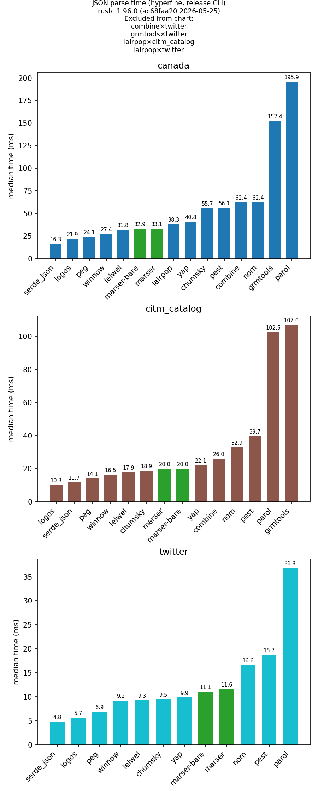

# JSON parser comparison

**AI assistance:** This document was drafted with AI assistance. The maintainer reviewed it. If anything looks wrong, please open an issue in your fork or upstream.

Compare Rust JSON parser examples (vendored from [parse-rosetta-rs](https://github.com/rosetta-rs/parse-rosetta-rs)) on shared fixtures, then plot parse times as a bar chart. Nom example was slightly modified because it failed on twitter.json and citm_catalog.json. Some other examples still fail on those fixtures, they are excluded from the resulting bar chart.

## Results:
Ran benchmark on github actions because my laptops performance is pretty unreliable.



marser examples marked in green. "marser" is an example with full error recovery / error information etc. "marser-bare" is an example without error recovery etc.
## Quick start

**Parse benchmarks only** (default):

```bash
./bench.py
```

Writes `results/results.json` and `results/chart.png`.

**Optional debug build benchmarks** (slow — runs `cargo clean` before each timed build):

```bash
./bench.py --build
```

Writes `results/build_results.json` and `results/chart_build.png`.

**Combine parse + build:**

```bash
./bench.py --build
```

(parse runs by default; add `--no-parse` to benchmark builds only.)

**Build benchmarks without generating the build chart:**

```bash
./bench.py --no-parse --build --no-build-chart
```

**Regenerate only the parse chart** from existing `results.json`:

```bash
./bench.py --parse-chart
# or: python3 scripts/plot_results.py
```

**Regenerate only the build chart** from existing `build_results.json`:

```bash
./bench.py --build-chart
# or: python3 scripts/plot_results.py --build
```

Outputs:

- `results/results.json` — median parse times per backend and fixture (failed pairs recorded with `error`, listed in `parse_failures`)
- `results/chart.png` — parse bar chart (one panel per fixture; backends that failed preflight on that fixture are omitted; regenerate with `--parse-chart` or `scripts/plot_results.py`)
- `results/build_results.json` — median debug build time per backend (`--build`)
- `results/chart_build.png` — debug build bar chart (`--build`, or `--build-chart`)

## What is measured

**Parse** (default, via hyperfine): wall-clock per run of each release `*-app` binary with a fixture path argument. That includes process startup, reading the file, and parsing — the same shape as the upstream rosetta apps.

**Debug build** (optional `--build`): hyperfine on `cargo build --package <name>` with `--prepare=cargo clean` before each run, matching the upstream rosetta build benchmark style. Release binary size and release compile time are not measured.

Fixtures (from [nativejson-benchmark](https://github.com/miloyip/nativejson-benchmark) `data/`):

- `fixtures/twitter.json`
- `fixtures/canada.json`
- `fixtures/citm_catalog.json`

`bench.py` forces `CARGO_TARGET_DIR` to `./target` so release binaries are always next to the repo (even if your environment sets a global target dir).

`null-app` is built but excluded from the chart (it only reads the file, no parse).

### `marser-app` vs `marser-bare-app`

| Example           | Role                                                                                                                                      |
| ----------------- | ----------------------------------------------------------------------------------------------------------------------------------------- |
| `marser-app`      | Vendored rosetta grammar: recovery, `Invalid` values, rich error hooks (`try_insert_if_missing`, `if_error`, annotations).                |
| `marser-bare-app` | Same AST shape without recovery, `Invalid`, or error-reporting matchers; still uses `commit_on` on numbers, strings, arrays, and objects. |

### Deviations from parse-rosetta-rs

#### `nom-app` (string parsing)

Upstream [parse-rosetta-rs `nom-app`](https://github.com/rosetta-rs/parse-rosetta-rs/blob/main/examples/nom-app/parser.rs) uses `escaped(alphanumeric, …)` for string bodies, which rejects many valid JSON strings (spaces, punctuation, Unicode letters, and `\uXXXX` escapes). That is enough for `canada.json` but not for the full nativejson set.

This repo replaces string parsing with the **fragment + `fold` pattern** from nom’s official [`examples/string.rs`](https://github.com/rust-bakery/nom/blob/main/examples/string.rs), adapted to `bytes::complete` and **JSON** escapes (`\u` plus four hex digits). The rest of the JSON grammar is still the vendored rosetta structure.

#### Fixtures and chart exclusions

`bench.py` runs a preflight parse before hyperfine. Failures are stored in `results.json` under `parse_failures` and are **not plotted** for that backend×fixture panel.

Last checked with the vendored examples (release build, preflight only):

| Backend     | twitter.json | canada.json | citm_catalog.json |
| ----------- | :----------: | :---------: | :---------------: |
| chumsky     |      ok      |     ok      |        ok         |
| combine     |   **fail**   |     ok      |        ok         |
| grmtools    |   **fail**   |     ok      |        ok         |
| lalrpop     |   **fail**   |     ok      |     **fail**      |
| lelwel      |      ok      |     ok      |        ok         |
| logos       |      ok      |     ok      |        ok         |
| marser      |      ok      |     ok      |        ok         |
| marser-bare |      ok      |     ok      |        ok         |
| nom         |      ok      |     ok      |        ok         |
| parol       |      ok      |     ok      |        ok         |
| peg         |      ok      |     ok      |        ok         |
| pest        |      ok      |     ok      |        ok         |
| serde_json  |      ok      |     ok      |        ok         |
| winnow      |      ok      |     ok      |        ok         |
| yap         |      ok      |     ok      |        ok         |

Typical causes (unchanged from stock rosetta grammars):

- **combine** — no `\uXXXX` handling in the escape mapping (fails when twitter contains unicode escapes).
- **grmtools** / **lalrpop** — lexer/grammar treats strings as `"[^"]*"` without escape sequences (fails on `\"` or `\u` inside strings).

Re-run the preflight loop after changing grammars:

```bash
FIX=fixtures BIN=target/release
for app in "$BIN"/*-app; do
  name=$(basename "$app" -app); [ "$name" = null ] && continue
  for f in twitter canada citm_catalog; do
    "$app" "$FIX/$f.json" >/dev/null 2>&1 && echo "OK $name $f" || echo "FAIL $name $f"
  done
done
```

## Local `marser` development

By default `marser-app` and `marser-bare-app` use `marser = "0.1.3"` from crates.io. When working in the `parsing/` monorepo, you can patch to your tree in the workspace root `Cargo.toml`:

```toml
[patch.crates-io]
marser = { path = "../marser" }
```

## Refreshing vendored examples

Optional: copy from a local `parse-rosetta-rs` checkout with `scripts/vendor-from-rosetta.sh` (maintainer only; not required to build). Re-apply the `nom-app` string parser afterward if you overwrite it.
